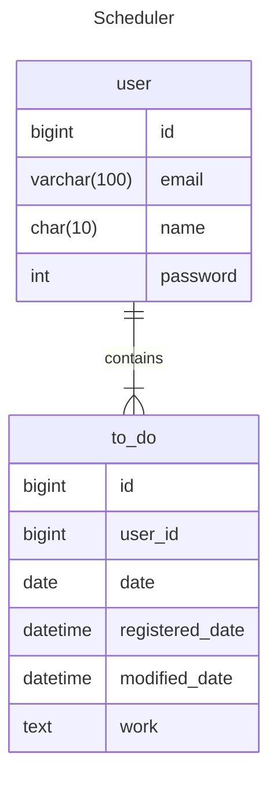

```markdown
📌 Scheduler API 명세서

1️⃣ 개요
이 API는 일정 관리 시스템을 위한 RESTful API로, 사용자의 일정 조회, 생성, 수정 및 삭제 기능을 제공합니다.

2️⃣ 엔드포인트 목록

| HTTP 메서드 | 엔드포인트 | 설명 |
|----------|--------------------------------------------|-----------------------|
| `공통 경로`| `/api/schedule`                            | 모든 엔드포인트 앞에 존재   |
| `GET`    | `/`                                        | 모든 일정 조회           |
| `GET`    | `/users/{name}-{id}`                       | 사용자 이름 으로 일정 조회  |
| `GET`    | `/modified-date/{date}`                    | 수정일 기준 일정 조회 |
| `GET`    | `/users/{name}-{id}/modified-date/{date}`  | 사용자 이름과 수정일 기준 일정 조회 |
| `GET`    | `/the-day/{date}`                          | 특정 날짜(D-DAY) 일정 조회 (페이지네이션 포함) |
| `POST`   | `/`                                        | 사용자 및 일정 생성 |
| `POST`   | `/users/to-dos`                            | 사용자 일정(To-Do) 생성 |
| `PATCH`  | `/users`                                   | 사용자 정보 수정 |
| `PATCH`  | `/users/to-dos`                            | 일정 수정 |
| `DELETE` | `/users`                                   | 사용자 및 모든 일정 삭제 |
| `DELETE` | `/users/to-dos/{toDoId}`                   | 특정 일정(To-Do) 삭제 |

---

3️⃣ API 상세 정보

✅ 3.1 모든 일정 조회
- GET /api/schedule/
- 모든 일정을 조회합니다.

🔹 요청 예시
GET api/schedule/ HTTP/1.1

✅ 3.2 사용자 이름 으로 일정 조회
- GET /api/schedule/users/{name}-{id}
- 특정 사용자(`name`, `id`)의 일정을 조회합니다.

🔹 요청 예시
GET api/schedule/users/홍길동-1? HTTP/1.1

✅ 3.3 수정일 기준 일정 조회
- GET /api/schedule/modified-date/{date}
- 특정 수정일(date) 기준으로 일정을 조회합니다.
- 정렬 방식(asc 또는 desc)을 지원합니다.
- 정렬 방식은 입력하지 않을 경우 asc 로 정렬됩니다. 

🔹 요청 예시
GET /api/schedule/modified-date/2024-01-30?order=desc HTTP/1.1

✅ 3.4 사용자 이름과 수정일 기준 일정 조회
- GET /api/schedule/users/{name}-{id}/modified-date/{date}
- 사용자 이름(name, id)과 특정 수정일(date) 기준으로 일정을 조회합니다.
- 정렬 방식(asc 또는 desc)을 지원합니다.
- 정렬 방식은 입력하지 않을 경우 desc 로 정렬됩니다.

🔹 요청 예시
GET /api/schedule/users/aaa-1/modified-date/2024-01-30 HTTP/1.1

✅ 3.5 D-DAY 일정 조회 (페이지네이션 적용)
- GET /api/schedule/the-day/{date}
- 특정 날짜의 일정을 조회하며, 페이지네이션 기능을 제공합니다.
- page 와 size 를 입력하지 않을 경우 기본 값은 1 과 10 입니다.
- 정렬 방식은 입력하지 않을 경우 asc 로 정렬됩니다.

🔹 요청 예시
GET /api/schedule/the-day/2024-02-05?page=1&size=10&order=asc HTTP/1.1

✅ 3.6 사용자 및 일정 생성
- POST /api/schedule
- 새로운 사용자와 일정을 생성합니다.
- 비밀번호는 숫자로 구성됩니다. 1 ~ 5 자리 숫자만 가능합니다.

🔹 요청 예시
POST /api/schedule HTTP/1.1

Body
{
    "user": {
            "name": "aaa",
            "email": "aaa@example.com",
            "password": "12345"
    },
    "toDo": {
            "date": "2024-02-10",
            "work": "운동 하기"
    }
}

✅ 3.7 일정 생성
- POST /api/schedule/users/to-dos
- 기존 사용자의 새로운 일정을 생성합니다.

🔹 요청 예시
POST /api/schedule/users/to-dos HTTP/1.1

Body
{
    "user": {
        "id" : "1",
        "name" : "aaa",
        "email" : "aaa@naver.com",
        "password" : "12345"
    },
        "toDo": {
        "work" : "캠핑 가기",
        "date" : "2024-01-23"
    }
}

✅ 3.8 사용자 정보 수정
- PATCH /api/schedule/users
- 사용자의 정보를 수정합니다.

🔹 요청 예시
POST /api/schedule HTTP/1.1

Body
{
    "id" : "1",
    "name" : "aaa",
    "email" : "aaa@naver.com",
    "password" : "12345"
}


✅ 3.9 일정 수정
- PATCH /api/schedule/users/to-dos
- 특정 일정(To-Do)의 내용을 수정합니다.

🔹 요청 예시
PATCH /api/schedule/users/to-dos HTTP/1.1

Body
{
    "user": {
        "id" : "1",
        "name": "aaa",
        "password" : "12345"
    },
    "toDo": {
        "id" : "1",
        "date" : "2024-01-31",
        "work" : "영화보기"
    }
}

✅ 3.10 사용자 및 일정 삭제
- DELETE /api/schedule/users
- 특정 사용자의 계정 및 모든 일정을 삭제합니다.

🔹 요청 예시
DELETE /api/schedule/users HTTP/1.1

Body
{
    "id" : "1",
    "name" : "aaa",
    "password" : "123455"
}

✅ 3.11 특정 일정 삭제
- DELETE /api/schedule/users/to-dos/{toDoId}
- 특정 일정(To-Do)만 삭제합니다.

🔹 요청 예시
DELETE /api/schedule/users/to-dos/{toDoId} HTTP/1.1

Body
{
    "id" : "1",
    "name" : "aaa",
    "password" : "12345"
}

4️⃣ HTTP 응답 코드 설명

|          상태 코드          |              의미              |
|---------------------------|-------------------------------|
| 200 OK                    | 요청 성공                       |
| 201 Created               | 리소스 생성 성공                  |
| 204 No Content            | 삭제 완료, 응답 바디 없음          |
| 400 Bad Request           | 요청이 올바르지 않음               |
| 401 Unauthorized          | 사용자가 존재하지 않거나 비밀번호 오류 |
| 404 Not Found             | 리소스를 찾을 수 없음              |
| 500 Internal Server Error | 서버 내부 오류                   |

⚠️ 모든 요청에는 Content-Type: application/json이 필요합니다.

🔐 보안: UPDATE, DELETE 및 PATCH 요청 시, 사용자 ID와 비밀번호를 필수로 입력해야 합니다.
```

